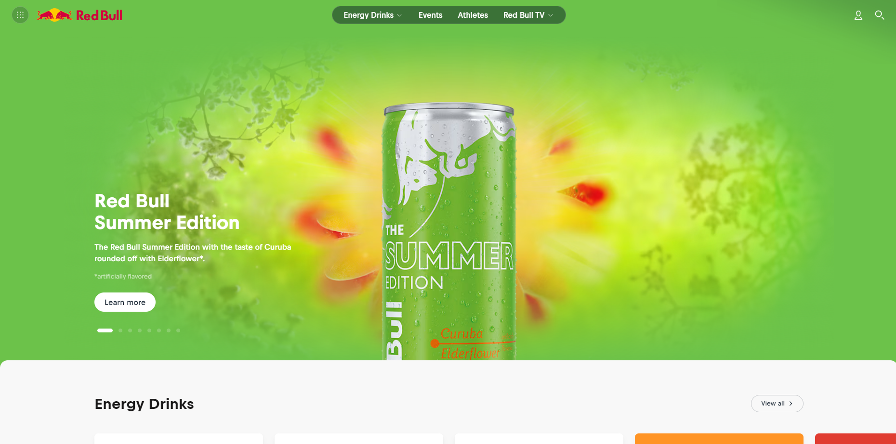

# Example Blog Post

In this chapter, I learned about different design techniques and strategies that Garr Reynolds utilizes in his presentations. Some of the most important ideas he goes over in this chapter are the signal-to-noise ratio (SNR), the use of negative space, and the rule of thirds. First off, the signal-to-noise ratio is a measurement of how much relevant vs. irrelevant information there is on a page, with the goal being to have the highest ratio possible. In order to evaluate this principle, I'm using a snapshot of Red Bull's website homepage. On this page, you can see that there isn't a lot of irrelevant or overwhelming information. Even the design elements are kept pretty minimal to ensure the user isn't bombarded with information when they enter the site. Another principle Reynolds talked about was the use of negative space. This principles explains that it's important to have space on a design that isn't filled with elements. This helps make the design feel less underwhelming and gives the user's eye a chance to rest. On the Red Bull website, there is quite a bit of negative space surrounding the main graphic. Additionally, the section under it contains a similar amount of negative space. This helps make the design feel more cohesive and professional. The final principles that Reynolds talked about was the rule of thirds. This is a principle borrowed from photography and it explains that humans find designs to be the most visually appealing when important subjects or pieces of information are placed along a one-third grid. On the Red Bull website, it looks as if the information for the featured drink is placed about one-third of the way onto the site. However, it also seems like the graphic for the can is directly centered. I think it would be interesting to place the can along one of the one-third lines and see how the design looks. I think placing the can on the left and having the text overlay might make the page more interesting as long as the text doesn't get lost in the graphic.

	
