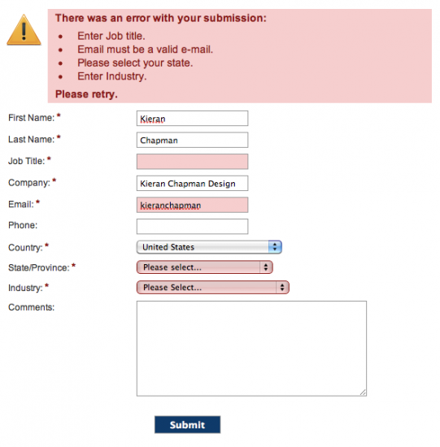

# Example Blog Post

One concept that really stood out to me in this chapter was the idea of positive psychology as it relates to user experience and design. The book takes a different approach from what I've been typically taught in school and encourages designers to push themselves outside the box and fail. Only by failing can designers learn from their mistakes. In contrast, I believe the traditional education system promotes the idea that students should stick to what they know and play it safe so they can receive a good grade. Furthermore, the book advises that designers should think positively for themselves and the people they interact with. I really enjoy this line of thinking as I think students and designers can get bogged down by the rules, budgeting, and logistics that come with creating a project which can lead to negative thought patterns. Instead, the book seems to argue for more of a "expect the best, plan for the worst" approach where designers should think positively about their users, but be forgiving of their mistakes. After all, as much as a designer wouldn't want to be punished for a design failure, a user wouldn't want to be punished for their mistake in using the design. The image I attached shows a form that instead of deleting the users data, saves it and gives them suggestions on how to correctly complete the form.

Source: The Design of Everyday Things (https://dl.icdst.org/pdfs/files4/4bb8d08a9b309df7d86e62ec4056ceef.pdf), page 63

