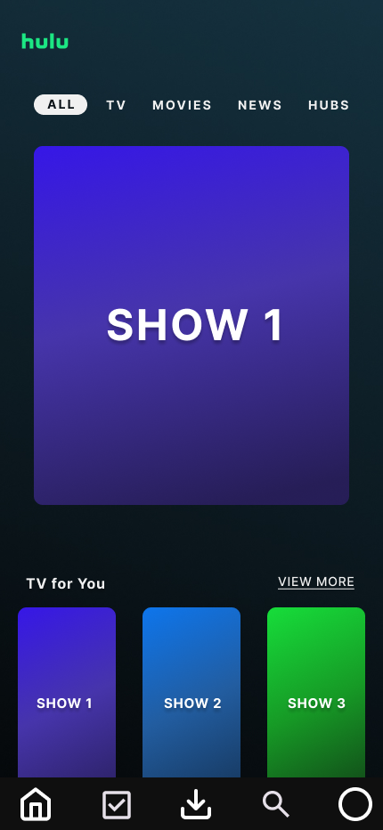
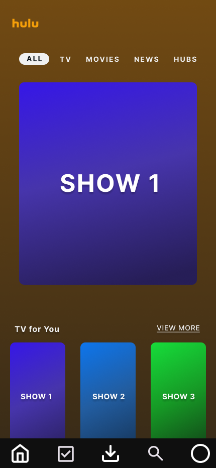
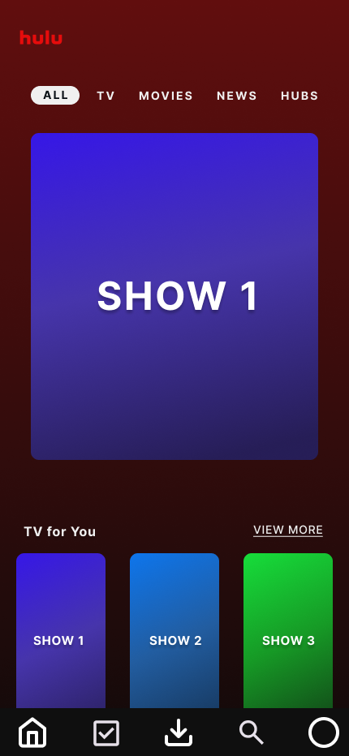
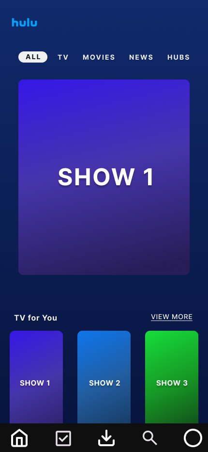

# Example Blog Post

For this exercise, I took a look at the Hulu app. Hulu is a video streaming platform with a constantly updating catalog of new shows, movies, and news broadcasts. I created a simple mockup of the app in Figma, and then experimented with three alternative colorways to analyze what different emotions and feelings the app gives off. 

The first user interface here shows the original Hulu screen with it's bright green logo and dark green/teal background. This is a fairly analogous color scheme with all the colors falling pretty close to each other on the color wheel. When designing this interface, I believe the designers wanted to give the user a sense of calmness as they sat down to watch their favorite movie or tv show. At the same time, the green palate gives off a sense of freshness as new shows continue to populate the app each week. Overall, I think it's a very pleasing design, and does a good job of balancing feelings of excitement with feelings of tranquility.

The second interface here is the first redesign I did and shows a bright orange Hulu logo overlayed on top of a burnt orange/brown backdrop. This, as with the following two examples, also follows an analogous color scheme as I wanted to keep the general idea Hulu was going for, while still experimenting with different colors. Overall I have mixed feelings about this color scheme. On one hand, I don't mind the brown background, and I think it also helps establish a sense of calmness in the user. On the other hand, the brown seems too safe for a tech and entertainment company who is constantly releasing new features and shows. I think if the shows were more geared towards relaxing content this wouldn't be a bad color scheme, but with the variety of shows Hulu has, I just don't think it works well.

My second redesign shows a bright red Hulu logo on top of a maroon/burgundy background. This is one design that I actually really like. I think the red gives a sense of warmth, guiding the user to cozy up for a night of entertainment. At the same time, it has a sense of passion or desire behind it that's perfect for couples looking to watch a movie for their date night. I also feel like the red is dulled enough so as to not spur any feelings of aggression or fear in the user. The only problem I could see with this color scheme is it has striking similarities to one of Hulu's main competitors, Netflix, and by using the same color scheme, it would be a bit harder for Hulu to differentiate themself.

The last redesign here shows an electric blue Hulu logo complemented by a dark blue background. This is my favorite color scheme out of all the redesigns. The electric blue logo conveys the feeling that Hulu is cutting edge and constantly evolving, which is perfect for a tech company. At the same time, as the user gets further down into the page, they are greeted with this dark blue gradient that's almost akin to diving deeper into unknown waters. It's elicits a sense of mystery and intrigue, while still feeling calming and tranquil. Overall, I really enjoy this color scheme, and if Hulu one day decided to change their app to these colors, I'd have no problem with it.

In conclusion, I think Hulu's designers did a very good job choosing the color scheme for their application. It conveys calmness while still feeling fresh. However, I think the most effective design would have to be the blue colorway. When a user is scrolling through an entertainment app like Hulu, they are either staying on the surface and watching a familiar favorite, or they venture down to explore what else the app has to offer. I think the blue colorway is a perfect visual representation of this journey. At the same time, the electric blue logo conveys that the app, and company are forever evolving and on the cutting edge of the latest technology. 