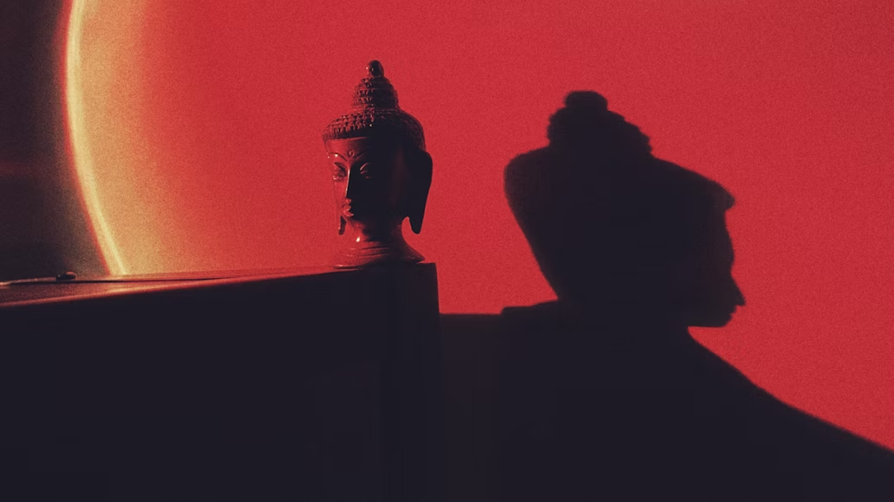

# Example Blog Post

Word: Aura

Throughout this section, the author goes on to describe the different colors and the attitudes surrounding them. For example, red is seen as aggressive, bold, and sensual whereas blue can be calm, open, and confident. I think this is something that I've picked up on throughout my life, but this is the first time I've seen it put into words. If I had to choose one word to describe this phenomenon, I would call it aura. Aura is the attitudes, feelings, and mental models we conjure up when we look at a certain color. Seeing a home filled with green plants reminds of the calmness and tranquility of nature. A person dressed in all yellow we might see as vibrant and outgoing. It's these auras surrounding colors that affect our everyday attitudes towards certain people, places, and things. I think this concept is important in my career as well because when I go and design logos, branding, and websites, I have to take a second to think about the aura or vibe of the company, and try to represent that in what I create. Not to mention, I can use these ideas in my personal projects to ensure that I'm communicating the proper feelings to the audience.

Photo by <a href="https://unsplash.com/@perotto?utm_content=creditCopyText&utm_medium=referral&utm_source=unsplash">Alexandre Perotto</a> on <a href="https://unsplash.com/photos/a-shadow-of-a-person-standing-next-to-a-statue-GGR8L-o_pWM?utm_content=creditCopyText&utm_medium=referral&utm_source=unsplash">Unsplash</a>
  