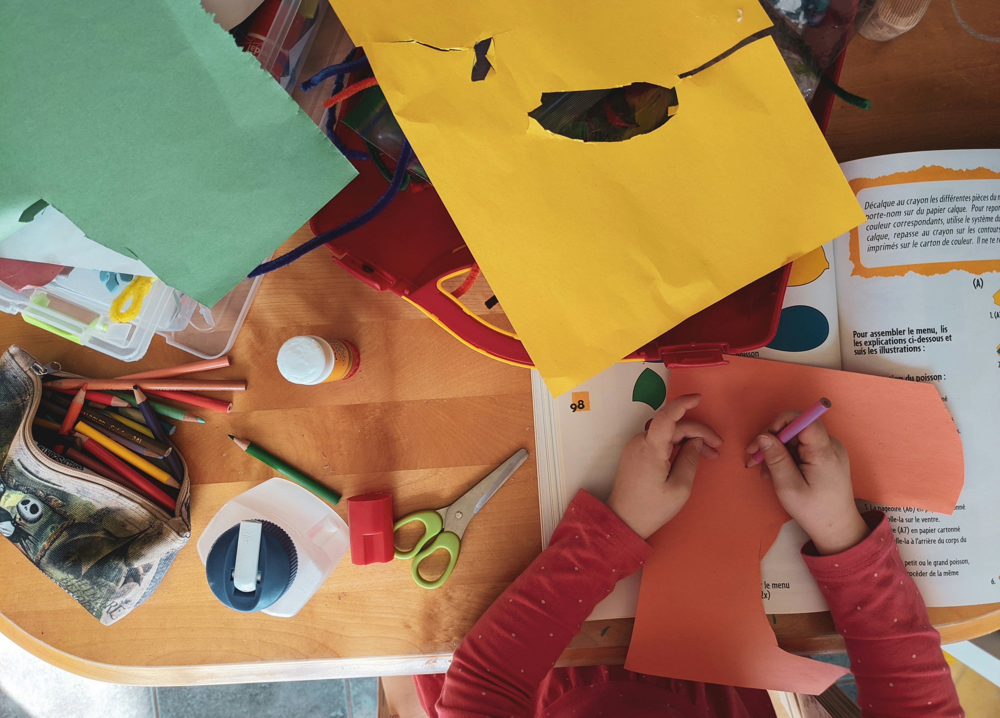

# Example Blog Post

I think one thing that really captured my attention in this reading was Garr's idea of the "Beginner's Mind". This is the idea that approach problem from a fresh, curious, and unburdened perspective. You let loose your preconceived notions of what is right/wrong, and instead stay open to all ideas. I think this is something that gets harder the older you get. Through school, you're constantly told that there is a "right" way of doing things, and are penalized for not doing those things a certain way. However, in order to breed true creativity, it's necessary to step outside this metaphorical box and a;;ow yourself the freedom to be weird, or to make mistakes. These mistakes should be seen as learning skills that help progress your skills. While sometimes the tried and true path may be the best solution to a given problem, if you don't think outside of that and try new things, you're potentially missing out on what could've been. This idea has always resonated with me. Whenever I see someone doing something "weird", I always have a sense of admiration for them, even if I don't necessarily like what they create. This translates to the art I consume, the music I listen to, and hopefully to my future designs. 

Photo by <a href="https://unsplash.com/@sigmund?utm_content=creditCopyText&utm_medium=referral&utm_source=unsplash">Sigmund</a> on <a href="https://unsplash.com/photos/person-holding-blue-and-red-paper-TJxotQTUr8o?utm_content=creditCopyText&utm_medium=referral&utm_source=unsplash">Unsplash</a>
  