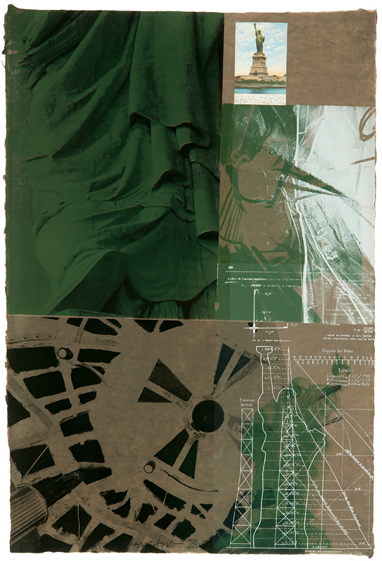
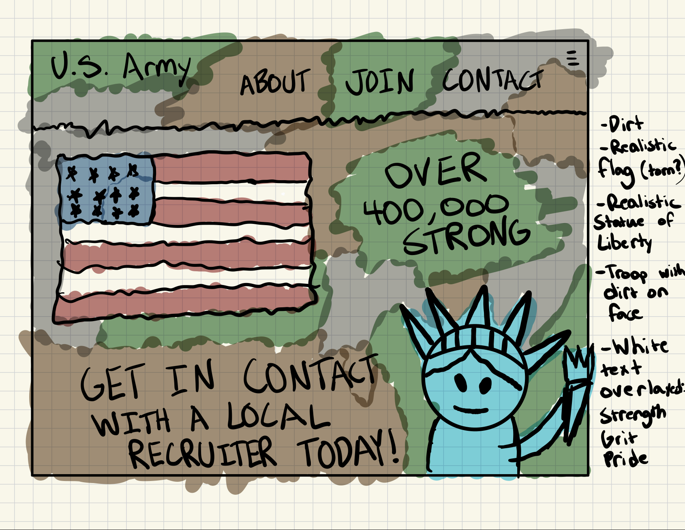

# Example Blog Post

Statue of Liberty (1983) - Robert Rauschenberg

This piece, entitled simply "Statue of Liberty", was created in 1983 by Robert Rauschenberg. Rauschenberg stated that he liked to mix different elements in his paintings, and wanted his work to fall somewhere in between the gap of art and real life. In the painting, Rauschenberg layers elements of American identity, particularly the Statue of Liberty. This is most likely inspired by the fact that he lived most of his life in New York City. He created this work using lithography, where a design is etched on to stone and then pressed against a paper to transfer it. 

"Layout"

The first thing that struck me about this painting was the layout. Immediately I was drawn to the close-up sweeping green texture of the Statue of Liberty's dress in the upper left hand corner. On the bottom-left, a dark black structural texture flows up to the right. Both these elements guide your eyes to the middle bottom-right of the piece which features a blueprint-esque overlay of the Statue of Liberty. This helps create a sense of depth and direction with the artwork that makes it really interesting to look at. Upon doing further research, I've discovered that artists use strong lines like this to help the reader focus on certain aspects of their composition. Strong diagonal lines indicate a faster directional movement, whereas thinner horizonal lines create a sense stability. 

Source: https://realismtoday.com/how-to-design-a-painting/

 

"Color Harmony"

Another thing that stuck out to me about this painting was how well the colors work together. The gritty browns and greens of the background are reminiscent of the traditional colors of the military. This may be Rauschenberg's attempt to display the character of the traditional American spirit, considering he was drafted into the military at one point. In contrast to this, strong white lines are overlayed displaying the Statue of Liberty, and above that some differing textures. I think this works well with the other colors, well still popping against the background, creating a sense of depth. After looking into this topic more, I found one quote that really stuck with me as it relates to color harmony. On Jeffrey Hayes's blog, when describing color harmony, he states "But in the end, the gut reaction that happens in the first few seconds is always right." My gut reaction to this painting's colors consists of feelings of grit, perseverance, ingenuity, and pride.

Source: https://www.jeffhayes.com/aesthetics-of-art/finding-the-color-harmony/

"Contrast"

The final thing I noted about this painting was the contrast it provided. Aside from the contrast of color, the painting incorporates numerous textures to convey its meaning. The top-left dress of the Statue of Liberty flows while still having these sharp rocky images. Similarly, the black structural texture has these rough edges that fight against the lower-left green paint it moves into. Additionally, at the top-right of the painting, a postcard of the Statue of Liberty can be seen which contrasts from everything else entirely. This creates a sense of personalness in the piece, almost as if that's a personal postcard Rauschenberg either sent or received. In a blog post from etchrLAB, the author states "contrast can be used to tell a story, to create a better composition, to create a sense of unease, to create a sense of peace." I think Rauschenberg accomplishes all of these with his use of contrasting colors, textures, and mediums.

Source: https://etchrlab.com/blogs/news/the-power-of-contrast-in-art

As a result of this painting, I chose to create a UI sketch for a new U.S. Army homepage. I imagined a gritty design featuring dirt textures, camo, a realistic (possibly torn) American flag, a realistic Statue of Liberty, and phrases like "Over 400,000 Strong." I really wanted to convey the fight and drive associated with the U.S. Army. I took inspiration from the color scheme of the original painting, and from the white designs overlayed. Ideally, I would overlay words like "GRIT" and "PRIDE" on the landing page to invoke a sense of patriotism in the potential applicant. The lines of the navbar and other elements would also be jagged, further emphasizing these ideals.

Overall, I learned a lot about different design techniques as a result of this exercise. From layout, to color harmony, to contrast, I've learned how these ideas are important for creating a cohesive piece which conveys a message. I then took these ideas and implemented them into a rudimentary sketch that tries to conveys a similar meaning using different design techniques.