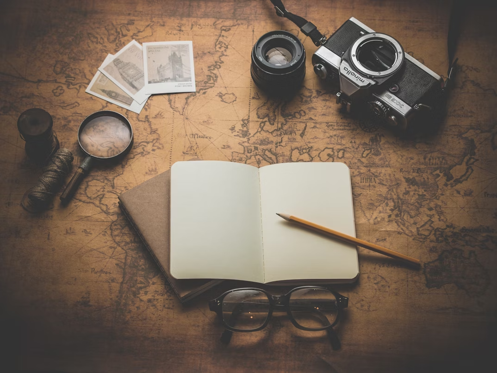

# Example Blog Post

As part of this reading, I wanted to make a summarized tutorial on how to create effective navigation on a website. While there are endless nuances to each of these steps, I thought these were some of the most important points.

Tutorial: How to create effective navigation on a website:

Step 1: Create a home link - Typically, this link will take the form a logo or specific typeface and reside on the top of the page. Users will then be able to use this link to navigate back to the homepage. It is common knowledge that these special designs should be links, so including the words "home" next to it is unnecessary. 

Step 2: Design a navigation menu - Have the most broad categories on the first level of the navigation menu, followed by secondary categories underneath each main one. When a user is on a certain page in the navigation menu, the corresponding text/block in the navigation menu should change to emphasize this.

Step 3: Include a breadcrumb trail - A breadcrumb trail is useful for letting the user know where they are in the website. This should be done by including all the relevant pages the user took to get to where they are separated by a greater than ">" sign. The current/final item in the breadcrumb menu should be bolded to show the user where they are.

Step 4: Include a search feature - Somewhere near your navigation bar, include an input box with the word "search" somewhere near it, and a button. If the button doesn't contain the word search, include an appropriate word like "go" in the button. Search features should be easily understood, and should encompass the entire website unless otherwise specified. For example, if the user is only able to search for authors on the website, include "Search for author" near the box so as not to cause confusion.

Photo by <a href="https://unsplash.com/@dariuszsankowski?utm_content=creditCopyText&utm_medium=referral&utm_source=unsplash">Dariusz Sankowski</a> on <a href="https://unsplash.com/photos/flat-ray-photography-of-book-pencil-camera-and-with-lens-3OiYMgDKJ6k?utm_content=creditCopyText&utm_medium=referral&utm_source=unsplash">Unsplash</a>
  