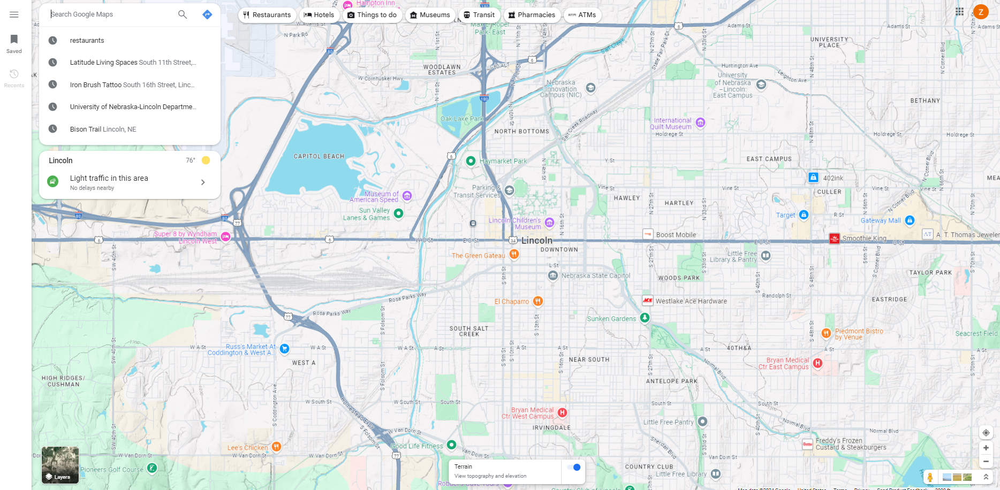

# Example Blog Post

I believe the Google Maps interface is an amazing example of what was described in the article. One of my biggest takeaways from the article was the idea of "Overview first, zoom and filter, then details-on-demand." Google Maps follows this principle by first providing an overview of the surrounding area, then allows users to filter restaurants, gyms, schools, etc., or zoom in on specific regions. Lastly, if a user decides to click on a location of interest, Google Maps provides them with more specific information on that location including its website, reviews, and address. This interface would also be an example of 2-dimensional data since its essentially an interactive map. If you look at the recent searches, you can also see that Google Maps does a good job of keeping track of what I've searched for in the past. In the article, this is termed "history". These principles are also used when mapping to a location as Google Maps will provide you with general directions first, and then allow you to customize your path based on your mode of transportation. If I had to make a recommendation as to where this interface could be improved, I would say that the "street view" mode can feel clunky at times, and isn't updated frequently, so it can be misleading.

