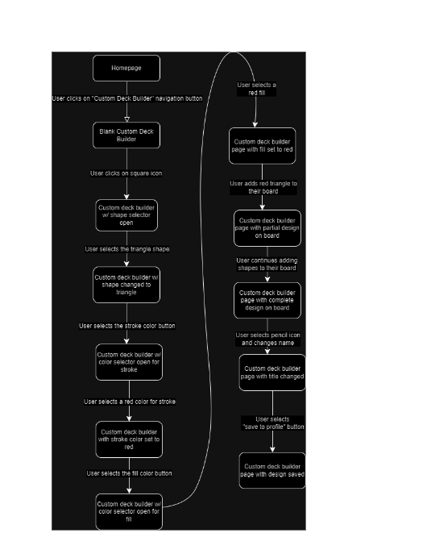
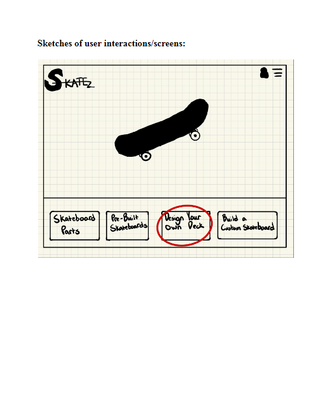
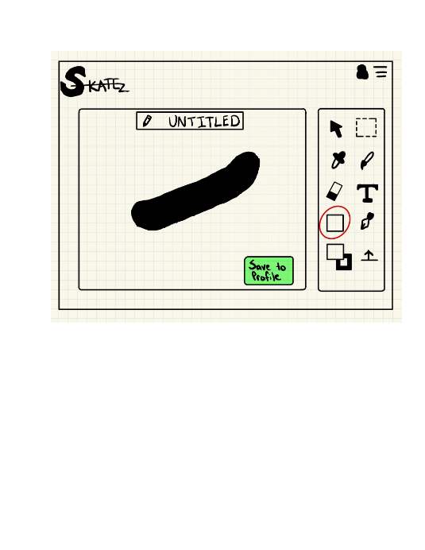
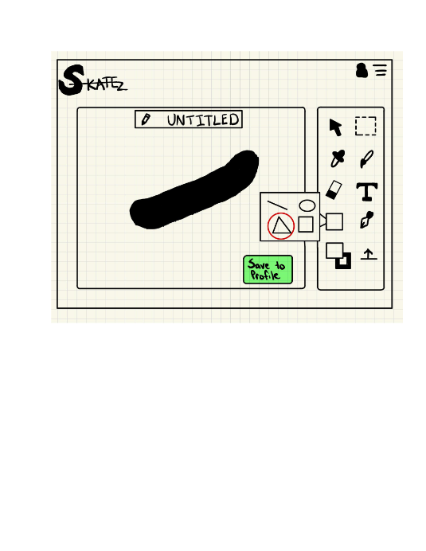
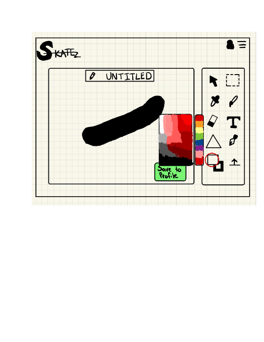
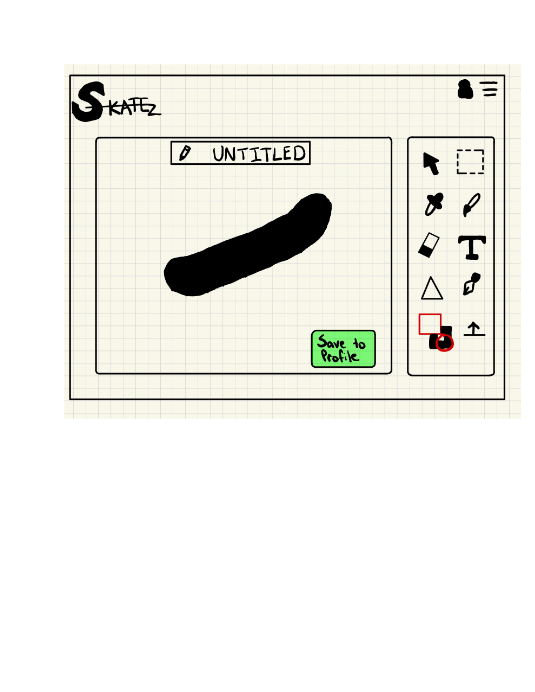
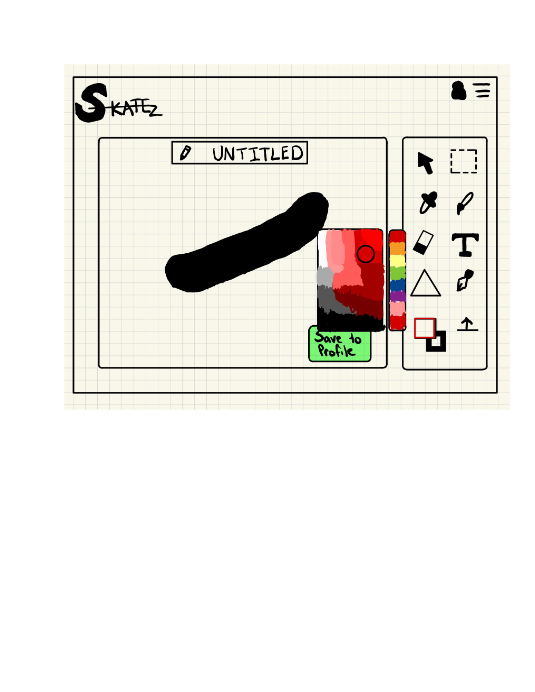
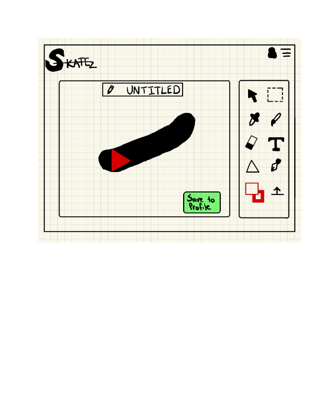
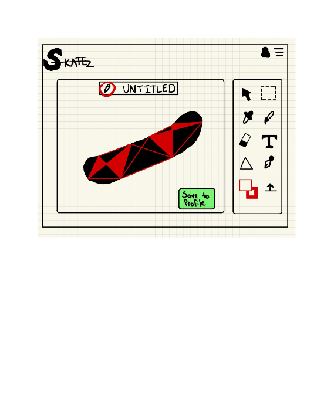
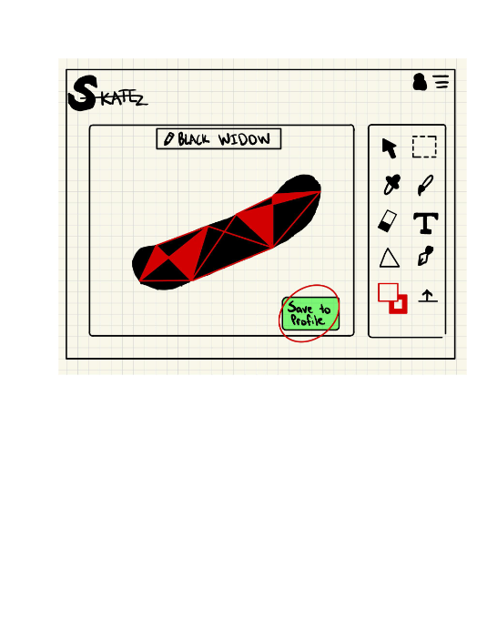

# Example Blog Post

Sketches & List of Components Document
For the sake of this document, we will assume our user is starting from the homescreen and wants to create a custom deck and save it to their account. 

List of screens needed to meet user’s needs in story:

Homepage,
Blank custom deck builder page,
Custom deck builder page with shape selector open,
Custom deck builder with shape changed to triangle,
Custom deck builder page with color selector open for stroke,
Custom deck builder page with stroke color set to red,
Custom deck builder page with color selector open for fill,
Custom deck builder page with fill color set to red,
Custom deck builder page with partial design on board,
Custom deck builder page with complete design on board,
Custom deck builder page with title change,
Custom deck builder page with design saved.

Flowchart on following page…

Sketches of user interactions/screens:

List of design elements my UI will/might require:
Top navigation menu,
Button with icon,
Design icons for
Shape,
Pen,
Paintbrush,
Stroke,
Fill,
Dropped,
Single selector,
Group selector,
Upload,
Eraser,
Text,
Color selector,
Primary heading,
Secondary heading,
Product/Brand logo,
Profile icon,
Menu accordion component,
Title textbox,
Tutorial prompt,
Login prompt,
3D render navigation arrows,
Featured product,
Product images,
Breadcrumb trail.